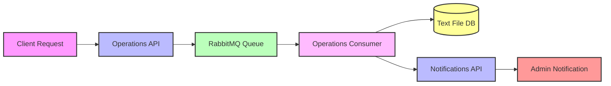

# Dummy Microservices Architecture

This project demonstrates a simple microservices architecture using Ruby, Sinatra, and RabbitMQ. It showcases how different services can communicate with each other through message queues and APIs.

## Architecture Overview

The project consists of the following components:

1. **Operations API** - Receives operation requests and publishes messages to RabbitMQ
2. **Operations Consumer** - Processes messages from RabbitMQ and sends notifications
3. **Notifications API** - Handles notification requests
4. **RabbitMQ** - Message broker for asynchronous communication

## Service Descriptions

### Operations API

- **Port**: 3000
- **Endpoint**: POST /api/operations
- **Function**: Receives operation requests from clients and publishes them to the RabbitMQ queue
- **Implementation**: Sinatra web application

### Operations Consumer

- **Function**: Subscribes to the RabbitMQ queue, processes messages, logs operations, and sends notifications
- **Implementation**: Ruby script running as a background service
- **Data Storage**: Writes operation logs to `/app/data/operations.txt`

### Notifications API

- **Port**: 3001
- **Endpoint**: POST /api/notifications
- **Function**: Receives notification requests with message and email parameters
- **Implementation**: Sinatra web application

### RabbitMQ

- **Ports**: 5672 (AMQP), 15672 (Management UI)
- **Function**: Message broker for asynchronous communication between services
- **Queue**: 'operations' (durable queue for reliability)

## Process Flow



## Data Flow

1. A client sends a POST request to the Operations API with a message
2. The Operations API publishes the message to the RabbitMQ queue
3. The Operations Consumer subscribes to the queue and processes incoming messages
4. The Operations Consumer logs the operation to a text file (acting as a simple database)
5. The Operations Consumer sends a notification request to the Notifications API
6. The Notifications API processes the notification and sends it to the service administrator

## Setup and Deployment

The project uses Docker Compose to orchestrate all services:

```bash
# Start all services
docker-compose up

# Start services in background
docker-compose up -d

# Stop all services
docker-compose down
```

## Testing the System

You can test the system by sending a request to the Operations API:

```bash
curl -X POST http://localhost:3000/api/operations \
  -H "Content-Type: application/json" \
  -d '{"message": "Test operation"}'
```

## Monitoring

- RabbitMQ Management UI: http://localhost:15672 (default credentials: guest/guest)
- Operation logs: Check the `data/operations.txt` file